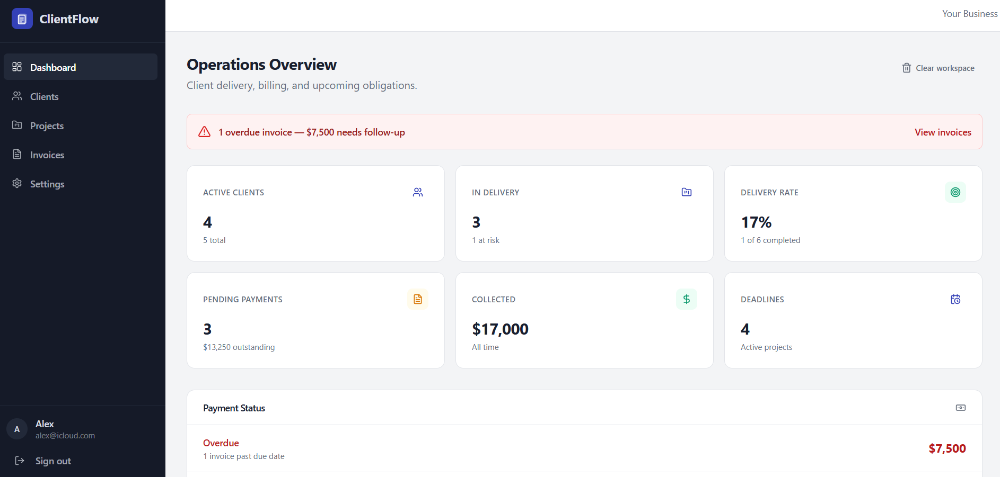
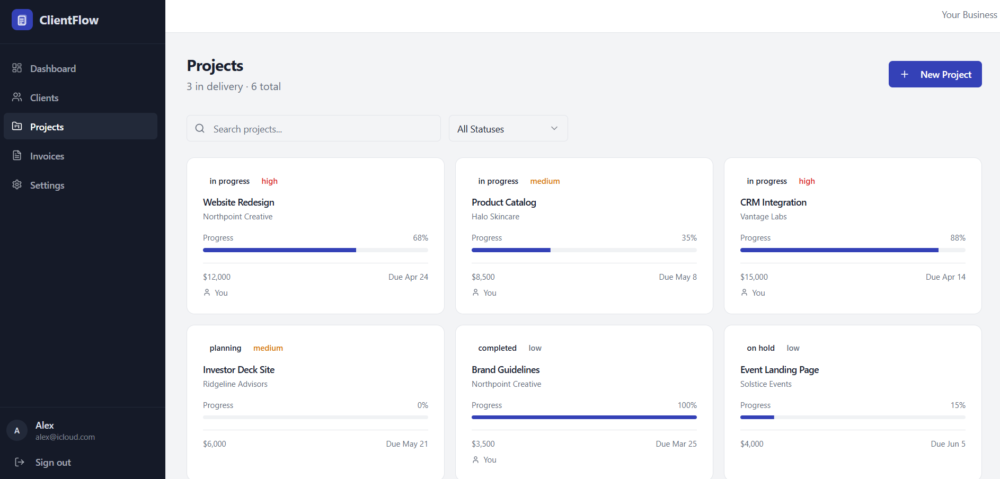
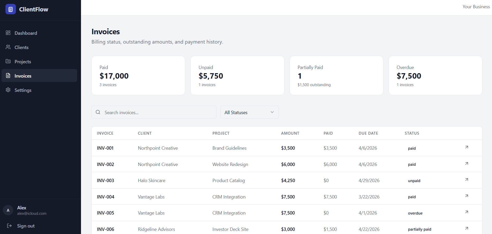

# ClientFlow

ClientFlow is a client operations platform built for freelancers, consultants, and small agencies who need more than a generic admin panel.

The project brings together client records, project delivery, invoices, follow-up, and operational visibility in one workspace.

## Overview

ClientFlow was built to explore what a more realistic business product looks like when the app is expected to do more than display cards and metrics.

The goal was to move beyond the usual dashboard plus CRUD formula and make the product feel more grounded in everyday work:
- managing clients
- tracking project status
- reviewing invoice states
- keeping an eye on delivery and follow-up
- moving through a fuller operational workflow

## Core Features

- View a structured operations dashboard with useful business context
- Manage client records and related work in one place
- Track project progress and delivery state
- Review invoice statuses such as paid, pending, and overdue
- Start with a clean workspace or load sample data to explore the product structure
- Move through a deeper internal workflow than a standard portfolio admin panel
- Use the interface comfortably on desktop and mobile

## Product Focus

The main strength of ClientFlow is depth.

Instead of making the app feel large through decoration, the product was shaped to feel more useful through:
- better information density
- stronger dashboard context
- client-facing operational records
- project detail depth
- billing and invoice visibility
- cleaner state handling

That makes it feel more like a working product and less like a surface-level demo.

## Why it stands out

ClientFlow is not meant to be a flashy agency template.

It was built to feel like a tool someone could actually work inside:
- clients are tied to real operational context
- projects are more than titles and badges
- invoice states matter
- the dashboard has a stronger what-needs-attention-now feel
- onboarding and sample-data behavior make product exploration easier without forcing fake data into every account

## Full Stack Direction

This project matters as a portfolio piece because it moves beyond frontend presentation.

The full-stack angle comes from the way the app is structured around:
- application state
- backend-connected workflow logic
- client, project, and invoice relationships
- account behavior
- operational depth instead of static UI

## Mobile Experience

ClientFlow was also shaped to remain usable on smaller screens:
- dashboard sections stack cleanly
- actions stay reachable
- client and invoice information remains readable
- the interface keeps its structure without collapsing into clutter

## What this project was meant to prove

With ClientFlow, the goal was to show that a business application can be:
- clean without being shallow
- structured without feeling stiff
- realistic without becoming bloated
- product-focused instead of template-focused

It is one of the strongest examples in the portfolio of combining UI quality with operational logic.

## Screenshots

## Screenshots

### Dashboard Overview

### Project Management

### Invoices & Billing

## Live Demo

## [Live](https://client-flow-tawny-eight.vercel.app/)

## [Repository](https://github.com/lazarbukejlovic/client-flow)

## Author

**Lazar Bukejlovic**

